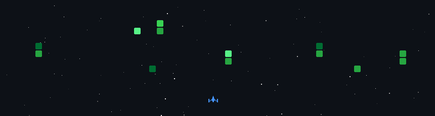

<h3><code>MihirParmar011@github ~ $ whoami</code></h3>
<h1>Mihir Parmar</h1>
<h3>Flutter & FlutterFlow Developer · Mobile Engineer · Clean Architecture Advocate</h3>

  
  
  
  

  

<h3><code>MihirParmar011@github ~ $ cat about.txt</code></h3>

Flutter & FlutterFlow Developer with 1+ year of professional experience building production-ready cross-platform mobile applications using Flutter, FlutterFlow, Dart, and Firebase. I design scalable mobile systems around <strong>Clean Architecture</strong>, leverage <strong>BLoC</strong> and <strong>Riverpod</strong> for robust state management, and build offline-first solutions with <strong>Hive</strong>.

B.E. Computer Engineering (GTU) · GitHub Foundations Certified

  

<h3><code>MihirParmar011@github ~ $ ls -l projects/</code></h3>

#### `1. Vedansh ERP – Manufacturing ERP`
A comprehensive manufacturing ERP for production, inventory, customers, and order management. 
**Stack**: Flutter · Firebase · BLoC · Clean Architecture 
**Highlights**: Expense tracking, analytics dashboards, modular Firebase backend, optimized application performance

#### `2. Measure Mitra – Tailor Management Platform`
A robust application for customer, measurement, order, billing, and delivery management. 
**Stack**: Flutter · Firebase · REST APIs · Hive · BLoC · Clean Architecture 
**Highlights**: Secure online/offline data sync, responsive Flutter UI, highly scalable architecture

#### `3. FoodDNA`
A feature-rich mobile application designed with a seamless user experience and modern architecture. 
**Stack**: Flutter · Dart · REST APIs · BLoC · Clean Architecture 
**Highlights**: Scalable state management, smooth animations, highly optimized rendering

#### `4. GeoFlow`
An advanced workflow application utilizing modern architecture and responsive design. 
**Stack**: Flutter · Firebase · REST APIs · BLoC · Clean Architecture 
**Highlights**: Local-first capabilities, real-time updates, modular feature architecture

  

<h3><code>MihirParmar011@github ~ $ ./show_skills.sh</code></h3>

  

#### 📱 Mobile Engineering & Frameworks

  
  
  
  
  
  
  
  

#### 🗄️ Backend & Database

  
  
  
  
  

#### 💻 Languages & Web

  
  
  
  
  
  
  

#### 🛠️ Tools & IDEs

  
  
  
  
  
  

#### 🚀 Currently Learning (DevOps & Cloud)

  
  
  
  
  
  

  

<h3><code>MihirParmar011@github ~ $ ./github_analytics.sh</code></h3>

<table align="center" width="100%" style="background-color: #0d1117; color: white; border-radius: 10px; overflow: hidden; border: none;">
  <thead>
    <tr>
      <th align="center" style="border: none; padding: 10px;">
        
      </th>
    </tr>
  </thead>
  <tbody>
    <tr>
      <td align="center" style="border: none; padding: 10px;">
        
      </td>
    </tr>
  </tbody>
</table>

  

  

Building reliable mobile experiences, one commit at a time.

