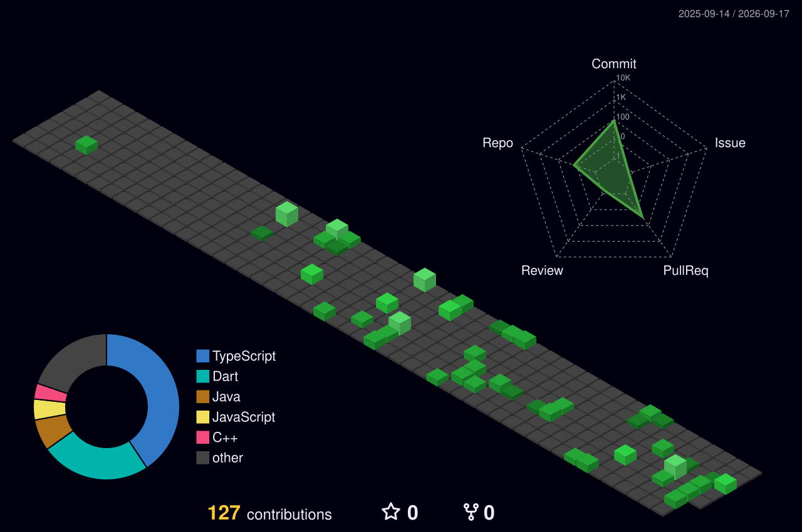

# 👋 Welcome to Mihir Parmar's GitHub Profile

### 🚀 Flutter Developer | ☁️ Cloud Enthusiast | 🏅 GitHub Foundation Certified

**Transforming ideas into seamless, scalable mobile experiences.**

 

 

  

<picture>
  <source media="(prefers-color-scheme: dark)" srcset="https://raw.githubusercontent.com/MihirParmar011/MihirParmar011/output/github-contribution-grid-snake-dark.svg" />
  <source media="(prefers-color-scheme: light)" srcset="https://raw.githubusercontent.com/MihirParmar011/MihirParmar011/output/github-contribution-grid-snake.svg" />
  
</picture>

  

---

## 👨‍💻 About Me

Hi 👋 I'm **Parmar Mihir Dineshbhai**, a passionate **Computer Engineering student** and **Flutter Developer** focused on building **clean, scalable, and high-performance mobile applications**.

- 🎓 **Education:** B.E. in Computer Engineering (GTU) — *Graduating May 2025*
- 📱 **Primary Focus:** Flutter development with clean architecture & state management
- ⚡ **Strengths:** Fast learner, logical problem solver, adaptable team player
- 🌱 **Currently Learning:** Backend Engineering, DevOps, and Cloud Computing
- 🏆 **Certification:** GitHub Foundation Certified

---

## 🏅 Certifications

| Certification | Issued By |
| :-- | :-- |
| **GitHub Foundation Certified** |  |

---

## 💻 Tech Stack & Tools

### 🚀 Programming Languages

  
  
  
  
  

---

### 📱 Mobile App Development

  
  

---

### 🛠️ Tools, IDEs & DevOps

  
  
  
  
  
  
  

---

### 🗄️ Database & Backend Services

  
  

---

## 🚀 What I'm Currently Working On

- 🏗️ **Scalable Flutter Apps** using **BLoC & Clean Architecture**
- 🔌 **Robust API Integration** and testing with **Postman**
- 🔄 **Agile Development Workflow** using **Jira**
- 📱 **Responsive & Pixel-Perfect UI/UX**
- 🔐 Secure Firebase authentication & backend integration

---

## 📊 GitHub Highlights

- 📈 Consistent contribution streaks
- 🧠 Strong focus on code quality & maintainability
- 🤝 Open to collaboration on Flutter & mobile projects

---

## 📫 Connect With Me

  

---

### 🌟 Let’s Build Something Impactful Together!

⭐ If you like my work, feel free to **star repositories** and connect with me.
